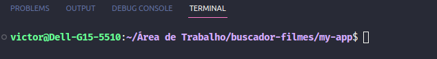

<h1>Projeto: Buscador de Filmes</h1>

<h2>Descrição do projeto</h2>

Projeto criado para busca de informações de filmes desejados.

<h2>Funcionalidades do projeto</h2>

O projeto consiste na busca de filmes pelas palavras digitadas pelo(a) usuário(a), além de mostrar os detalhes.

<h2>Tecnologias utilizadas</h2>

<ul>
    <li>React</li>
    <li>HTML</li>
    <li>CSS</li>
    <li>Javascript</li>
    <li>API TMDB</li>
    <li>React Router Dom</li>
    <li>DotEnv</li>
    <li>IDE utilizada: VS Code</li>
</ul>

<h2>Inicialização</h2>

1 - Instale o Node.Js para conseguir rodar o React. Caso possua instalado, pule essa etapa

2 - No terminal do VS Code (ou na IDE que você estiver utilizando), utilize o comando "git clone https://github.com/victoramos1/buscador-filmes" (sem aspas) caso tenha o Git instalado no computador, ou faça o download do arquivo .zip diretamente do GitHub.

3 - Com a pasta aberta na IDE (o caminho mostrado no terminal precisa levar ao projeto no seu computador, como mostrado na imagem abaixo), execute o comando "npm install" (sem aspas) no terminal da IDE.

4 - Gere uma chave para API do The Movie DataBase (TMDB) conforme o link https://developers.themoviedb.org/3/getting-started/introduction e armazene para usar no passo seguinte.

5 - Entre no arquivo ".env.example" e siga os passos

6 - No termina da IDE, rode o comando "npm start" (sem aspas) e aguarde uma aba no seu navegador abrir com o projeto em execução.

<h2>Status do projeto</h2>

Versão 1.0.1 finalizada.
